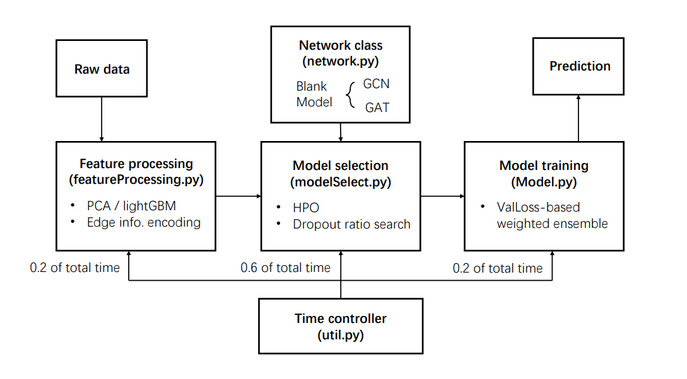

# AutoML for Graph Representation Learning

**Figure:** *The sturcture of the AutoML model.*

This is the repository for 2020 Fall Data mining course project, which proposes a practical scheme to do automated machine learning for graph-structured data. There are several parts in our scheme: Feature processing selects important features from the raw feature table and directly encodes edge information into input. Model selection which compares different networks’ performance on the validation set and selects the best network with certain parameters to do further training. Model training trains the selected network with full data set and do weighted ensemble. A time controller is used to balance time used in all three parts(0.2, 0.6, 0.2 of total time for each part), which guarantees the model return the prediction of test nodes within the time budget. See final report [there](./FinalReport.pdf).
